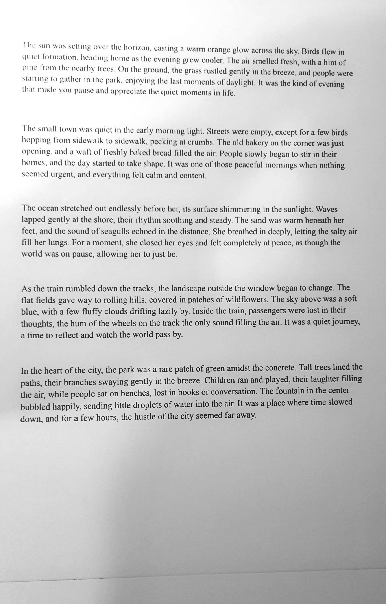
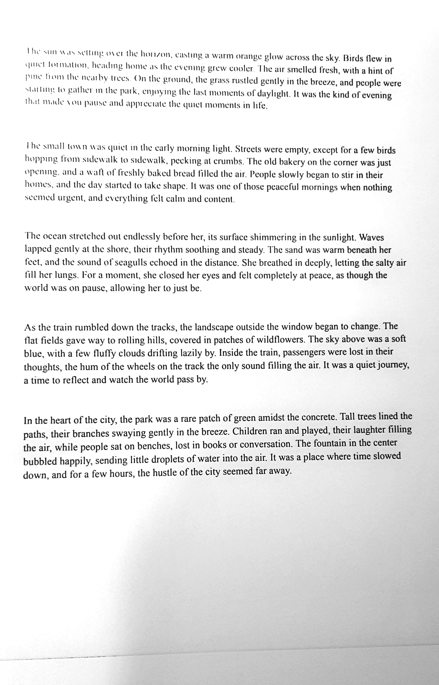
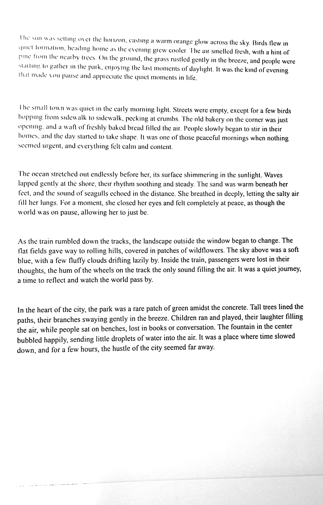
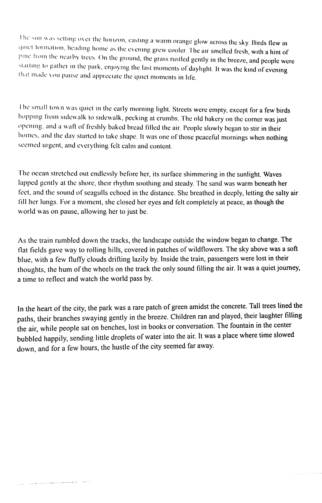

# Image Processing Results

While the shadows in the background are significantly reduced, the text in the upper-right corner remains unsharpened. Additionally, the processing time of 51 seconds is excessive, making this approach impractical for use.

## Processed Images and Time Data

| Subsection Size | Processed Image | Time Taken             |
|-----------------|-----------------|------------------------|
| **Original**       |  | 9 seconds              |
| **20x20**       |  | 9 seconds              |
| **50x50**       |  | 8 seconds              |
| **100x100**     |  | 8 seconds              |
| **200x200**     |  | 16 seconds             |
| **500x500** (Final Image)     |  | 16 seconds             |

