# OCR Conversion Results
The conversion results are highly variable, with some images showing near-perfect text recognition, while others produce a string of nonsensical characters. When evaluated subjectively, the recognition is generally accurate, with over 75% of the text passing the autocorrect checker in most test cases. The only exception is Image 1, which is notably unreadable due to blurriness. All other images meet the 25% error threshold. A closer analysis reveals that inaccuracies often occur in areas where the text is unclear, such as shadows, tilts, or distortions. Overall, the algorithm performs well and can be considered a reasonable success.

| Image Number | Before Image | After Image | Text from OCR|
|--------------|--------------|-------------|--------------|
| 1            |  | 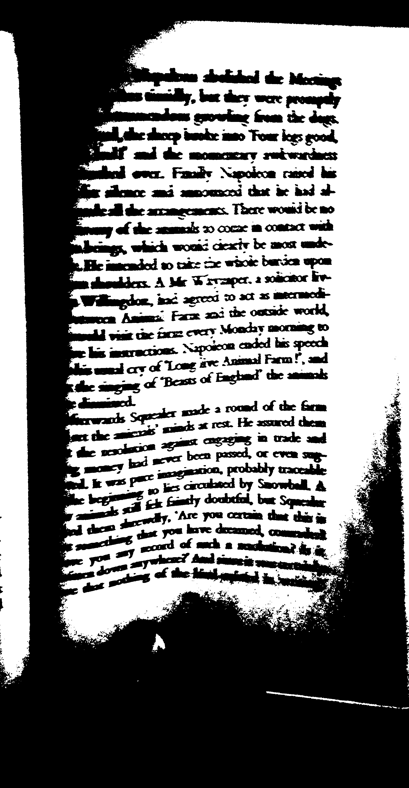 | -1 |
| 2            | 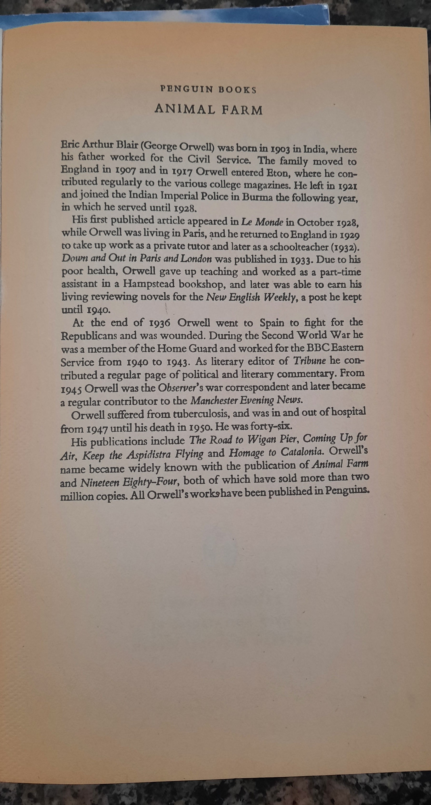 |  | PENGUIN BOOKS ANIMAL FARM brick rather flair( Ge: a ge his father worked for he, chair serve The ne wi* o inland in 1907 and in 1917 Orwell entered ton where he m pigweed Febulanly 2© the various college magazines, He let in 1921€ an imperil ice i‘ in which he served until nary Police in Burma the following year, His first published article appeared in Le Monde in October 1928 while Orwell was living in parts, and he returned to inland in 1929 to take up work as a private tutor and later as a schoolteacher( 1932). Down and Out in parts and onion was published in 1933. Due to his poor health, Orwell gave up teaching and worked as a part- time assistant in a homestead bookshop, and later was able to earn his living reviewing novels for the New English Weekly, a post he kept until 1940. At the end of 1936 Orwell went to Spain to fight for the Republicans and was wounded. During the Second World War he was a member of the Home Guard and worked for the BBC Eastern Service from 1940 to 1943. As literary editor of Tribune he con- tribute a regular page of political and literary commentary. Prom 1945 Orwell was the Observer’ s war correspondent and later became a regular contributor to the Manchester Evening News. Orwell suffered from tuberculosis, and was in and out of hospital from 1947 until his death in 1950. He was forty- six. His publications include The Road to ligan Pier, Coming Up for Air, Keep the Aspidistra Flying and Homage to catatonia. Orwell’ s name became widely known with the publication of Animal Farm and Nineteen Eighty- Four, both of which have sold more than two million copies. All Orwell’ s workspace been published in Penguins. |
| 3            |  |  | could bear. With one actor. the kind had been planned beforehoe then of themselves upon their tormentors, Jones oO the men suddenly found themselves being by ned kicked from all sides. The situation was nite and their control. They had never seen are renew of like this before, and this sudden uprising of crew nave whom they were used to thrashing and maltreating just as they chose, frightened them almost out of their wits. After only a moment or two they gave u trying to defend themselves and took to their heels A minute later all five of them were in full flight down the cart- track that led to the main road, with the animals pursuing them in triumph, Mrs Jones looked out of the bedroom window, saw what was happening, hurriedly flung a few possessions into a carpet bag, and slipped out of the farm by another way. moves sprang off his perch and flapped after her, croaking loudly. Meanwhile the animals had chased Jones and his men out on to the road and slammed the five- barred gate behind them. And so, almost before they knew what was happening, the Rebellion had been successfully carried through: Jones was expelled, and the Manor Farm was theirs. For the first few minutes the animals could hardly believe in their good fortune. Their first act was to gallop in a body right round the boundaries of the farm, as though to make quite sure that no human being was hiding anywhere upon it; then they raced back to the farm buildings to wipe out the last 19 |
| 4            | 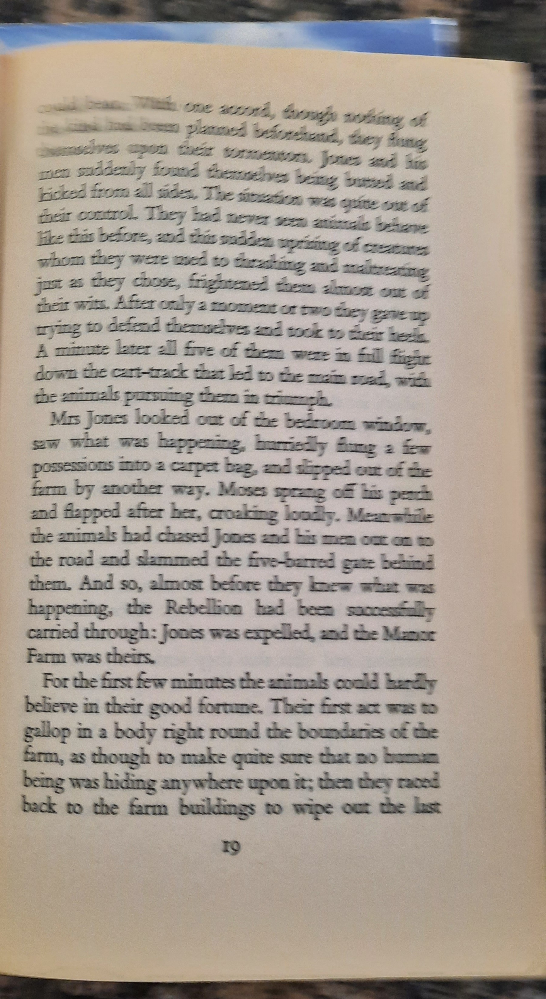 | 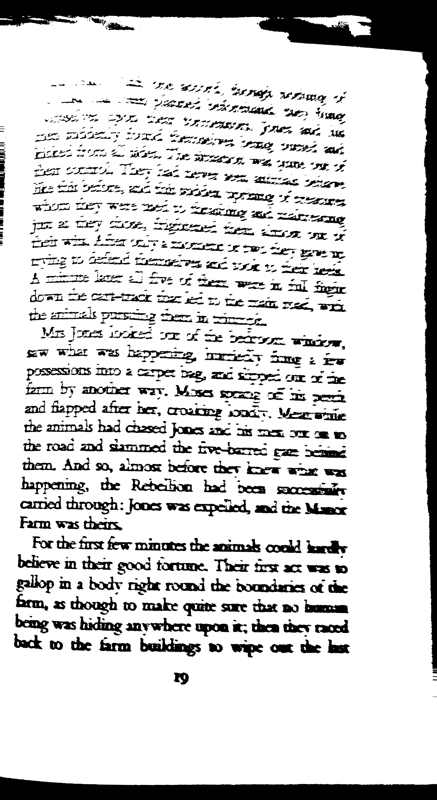 | ES OAR AY Oe See em IIT~= ha“ a a a-”._— we IE BA So ate ee- SEY Pe Ese,- Mee..*._ 4 1 ALS. a Tih we 7 8F~*.--“* 4 i, OT UE er tee ee is<.-. IMA MSA hoy“~~._< S on TLE SES. SIs p= Pa us I5 SASST LU Sherry see 2 7 Ss Leper la we ag_ over see.“-“-: DICED AG Re OF 4 i a, wag,< acre crap od 1“ my: C3. pow----°°-—--.= ore,-= is Tot STS, a ore wee.:“ I a earn, of think PSD for, TS stay“ ee& ante 4 So: DS good Was TOES WETS Se i See see we ASE HO es Eve of he were a Sal Sie Farm was there. gallop in« body right round the boundaries of te farm, as though to make quite sure the to boy back to the farm buildings w wipe out the last-¥ Q |
| 5            |  |  | ee THE CYCLONE from growing as gray as her other surroundings. Toto was not gray; he was a little black dog, with long silky hair and small black eyes that twinkled merrily on i- ther side of his funny, wee nose. Toto played all day long, and Dorothy played with him, and loved him dearly. Today, however, they were not playing. Uncle Henry sat upon the doorstep and looked anxiously at the sky, which was even grayer than usual. Dorothy stood in the door with Toto in her arms, and looked at the sky too. Aunt Em was washing the dishes. From the far north they heard a low wail of the wind, and Uncle Henry and Dorothy could see where the long grass bowed in waves before the coming storm. There now came a sharp whistling in the air from the south, and as they turned their eyes that way they saw ripples in the grass coming from that direction also. Suddenly Uncle Henry stood up.“ There’ s a cyclone coming, Em,” he called to his wife.“ T’ ll go look after the stock.” Then he ran toward the sheds where the cows and horses were kept. Aunt Em dropped her work and came to the door. One glance told her of the danger close at hand.“ Quick, Dorothy!” she screamed.“ Run for the cell- lar!” Toto jumped out of Dorothy’ s arms and hid under ar 3& |
| 6            | 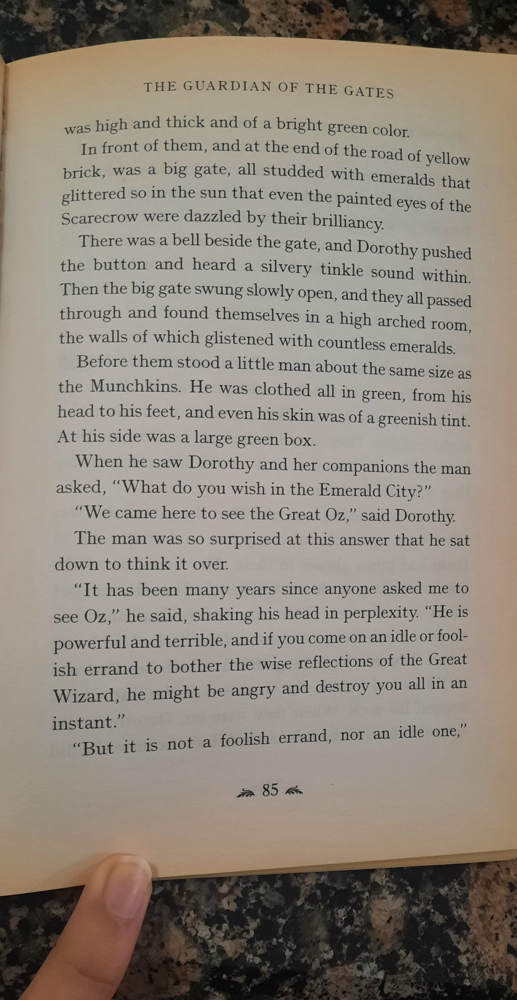 | 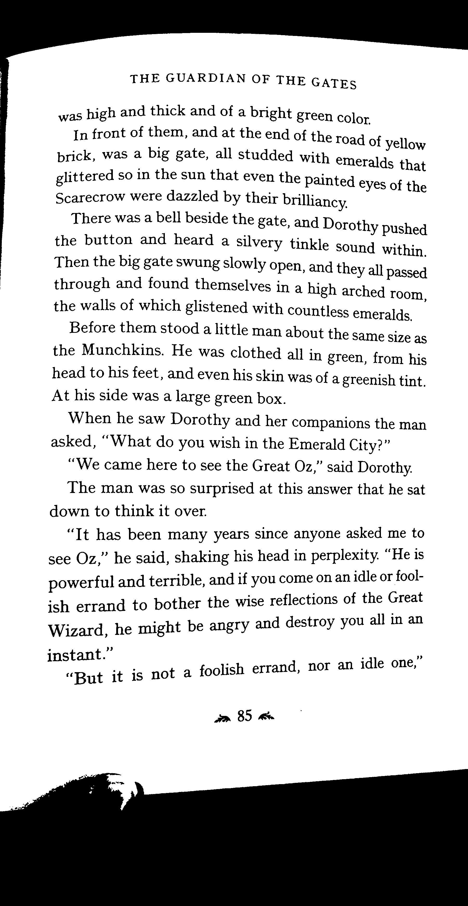 | THE GUARDIAN OF THE GATES was high and thick and of a bright green color In front of them, and at the end of the Toad of hello prick, was a big gate, all studded with emeralds that glittered so in the sun that even the Painted eyes of th Scarecrow were dazzled by their brilliancy,, There was a bell beside the gate, and Dorothy pushed the button and heard a silvery tinkle sound within Then the big gate swung slowly open, and they all passed through and found themselves in a high arched room the walls of which glistened with countless emeralds| Before them stood a little man about the same size as the Munchkins. He was clothed all in green, from his head to his feet, and even his skin was of a greenish tint. At his side was a large green box. When he saw Dorothy and her companions the man asked,“ What do you wish in the Emerald City?”“ We came here to see the Great Oz,” said Dorothy. The man was so surprised at this answer that he sat down to think it over.“ It has been many years since anyone asked me to see Oz,” he said, shaking his head in perplexity.“ He is powerful and terrible, and if you come on an idle or fool- ish errand to bother the wise reflections of the Great Wizard, he might be angry and destroy you all in an instant.”“ But it is not a foolish errand, nor an idle one,” a 8)& |
| 7            | 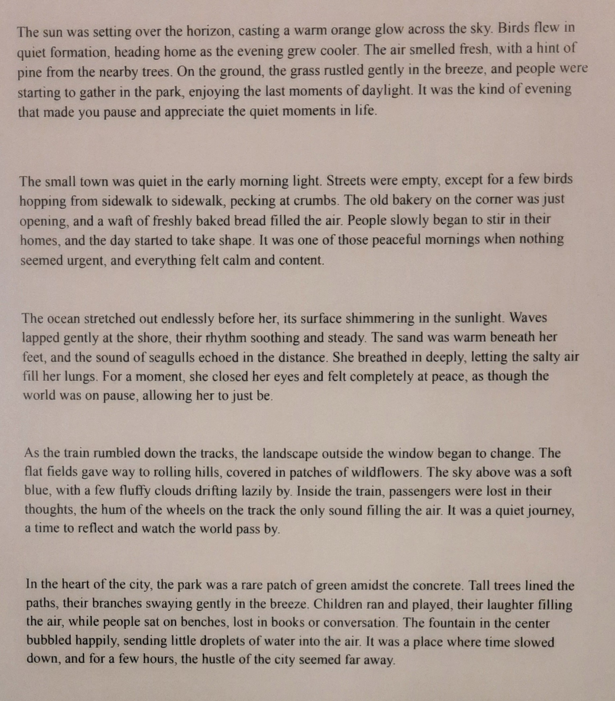 | 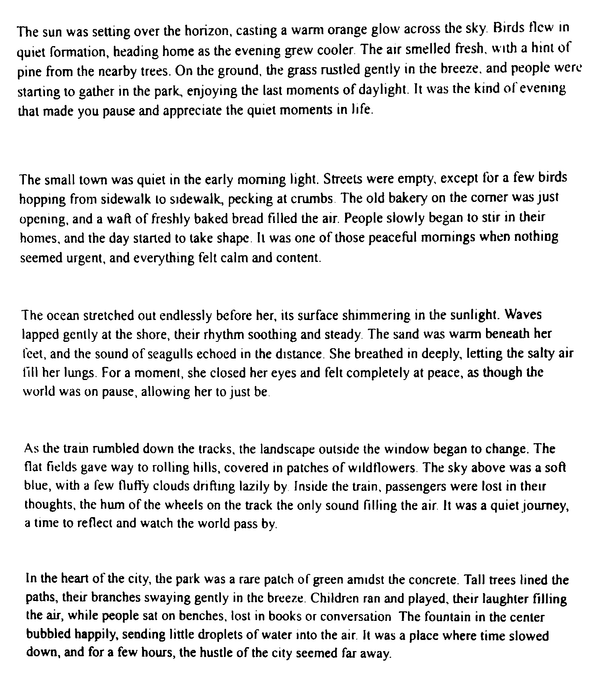 | The sun was setting over the horizon, casting a warm orange glow across the sky. Birds flew in quiet formation, heading home as the evening grew cooler. The air smelled fresh, with a hint of pine from the nearby trees. On the ground, the grass rustled gently in the breeze. and people were starting to gather in the park, enjoying the last moments of daylight. It was the kind of evening that made you pause and appreciate the quiet moments in life. The small town was quiet in the early coming light. Streets were empty, except for a few birds hopping from sidewalk to sidewalk, pecking at crumbs. The old bakery on the comer was Just opening, and a waft of freshly baked bread filled the air. People slowly began to stir in their homes, and the day started to take shape. It was one of those peaceful comings when nothing seemed urgent, and everything felt calm and content. The ocean stretched out endlessly before her, its surface shimmering in the sunlight. Waves lapped gently at the shore, their rhythm soothing and steady. The sand was warm beneath her( get, and the sound of seagulls echoed in the distance. She breathed in deeply, letting the salty air fill her lungs. For a moment, she closed her eyes and felt completely at peace, as though the world was on pause, allowing her to just be. As the train rumbled down the tracks, the landscape outside the window began to change. The flat fields gave way to rolling hills, covered in patches of wildflowers. The sky above was a soft blue, with a few fluffy clouds drifting lazily by. Inside the train, passengers were lost in their thoughts, the hum of the wheels on the track the only sound filling the air. It was a quiet journey, a me to reflect and watch the world pass by. In the heart of the city, the park was a rare patch of green amidst the concrete. Tall trees lined the paths, their branches swaying gently in the breeze. Children ran and played, their laughter filling the air, while people sat on benches, lost in books or conversation The fountain in the center bubbled happily, sending little droplets of water into the air. It was a place where time slowed down, and for a few hours, the hustle of the city seemed far away. |
| 8            |  |  | 1. Open flames, Including caries, are not permitted in buildings except as part of lab apparatus, approved food services and maintenance/ construction approved by Plant Operations. Bicycles are not allowed in buildings, except in approved designated locations. Corridors and stairwells must be free of obstructions and any combustible or flammable materials. Items located in corridor or stairwell must be approved by Plant Operations. self- closing doors must be able to Close. Wedges are only permitted as a temporary measure to hold doors open while attended. Fire safety equipment including exit signs, fire extinguishers, and fire hose cabinets must be kept unobstructed. |
| 9            |  |  | to floor or y to ing. Do NOT is and tactical and on coat in encounter agency IS. ail of ning in the t least 30 s for ee ee Ne see ee 8 Persons with mobility difficult: 2; or who use wheelchairs so: as to an area of refuge( stairwcti, room with phone). Controlled evacuation In non- fire situations threatening safety, such as building services interruption or hazardous material spill, buildings are evacuated under direction of UW Special Constable Service, fire wardens and emergency response services. The fire alarm should not be used to evacuate a building without approval. Hazardous material spill UW Special Constable Service 519- 888- 4911 or ext. 22222 Fire/ Evacuation Training and Information: Safety Office( Commissary Building) waterloo. ca/ safety- office safety@ waterloo. ca or ext. 33587 Fire Equipment Service: Plant Operations ext 22792 |
| 10           | 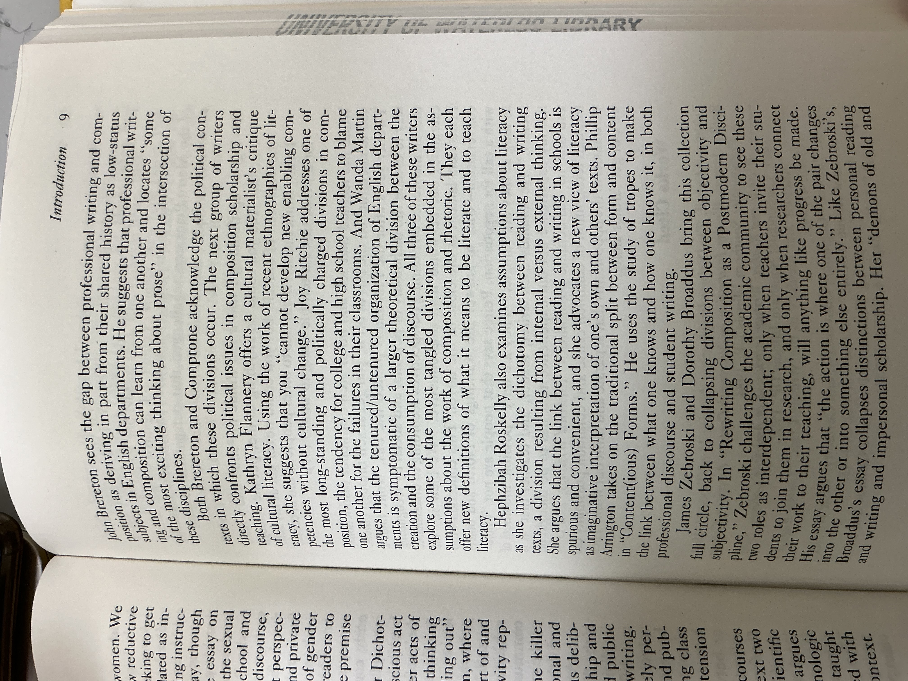 | 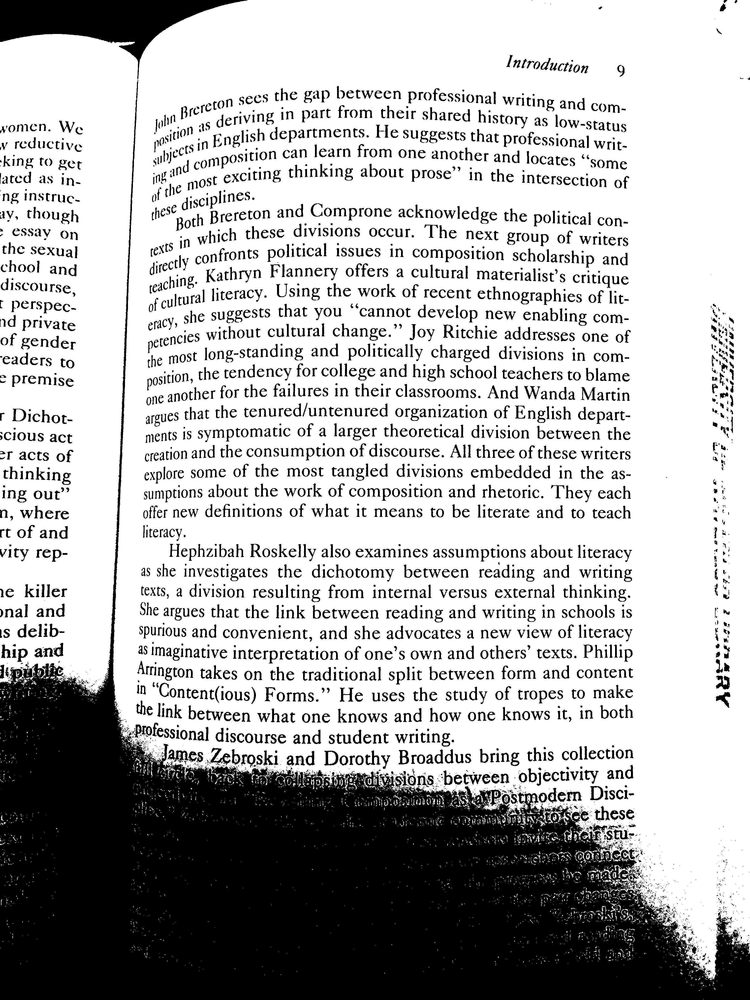| women. We v reductive‘ king to get ate as in. ng instruct. ay, though> essay on the sexual] chool and discourse, rT perspex. nd private of gender leaders to> premise tr dicot- sCIOUS act> r acts of thinking ing out” n, where rt of and city rep- 1e killer anal and is deli- Professional discourse I introduction 9 ton sees the gap between Professional nt er deriving in part from their shared his posi? in English departments. He suggests that over imposition can learn from one another a writing and com- try as low- status professional writ- her and locates“‘ some in the intersection of 0 me disciplines. ese th Brereton and compose acknowledge the political con-., which these divisions occur. The next group of writers xP| confronts political issues in composition scholarship and n chip. Kathryn flannel offers a cultural materialist’ s critique i cultural literacy. Using the work of recent ethnographies of lit- acy, she suggests that you cannot develop new enabling com- end es without cultural change. Joy bitchier addresses one of the most long- standing and politically charged divisions in com- position, the tendency for college and high school teachers to blame one another for the failures in their classrooms. And wanna Martin argues that the tenured/ unsecured organization of English depart- meets is symptomatic of a larger theoretical division between the creation and the consumption of discourse. All three of these writers explore some of the most tangled divisions embedded in the as- sumption about the work of composition and rhetoric. They each offer new definitions of what it means to be literate and to teach literacy. Hephzibah Roskelly also examines assumptions about literacy as she investigates the dichotomy between reading and writing texts, a division resulting from internal versus external thinking. She argues that the link between reading and writing in schools is spurious and convenient, and she advocates a new view of literacy as imaginative interpretation of one’ s own and others’ texts. chilli Arrington takes on the traditional split between form and content in“ Content( ious) Forms.” He uses the study of tropes to make¢ link between what one knows and how one knows it, in both and student writing. ng this collection us bra“ ol tween objectivity and betwee SF APR EP ST EM HD“ a< 2 else Fl be a SEE ME m95€ go res= od re Ir a, OREM a Pt ee wWEertgse&€* AUN |
| 11           |  | 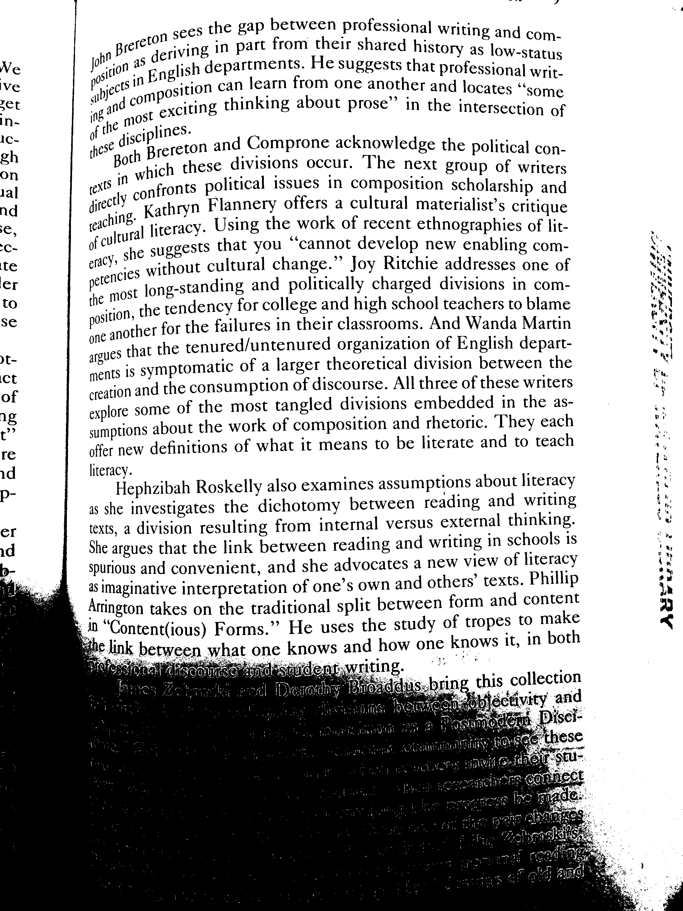| a 7- ton sees the gap between professional writing and¢ o in are deriving In part from their shared history as low status vs S Ve tio” a english departments. He suggests that professional wr; give po. its 18. in can learn from one azoth na WTI et a n comp thinking about her and locates“ some in- in"| most exciting 5 prose in the intersection of om of the- eciplines- eh ese ch Brereton and compose acknowledge the political con- on in which these levee eves in, The next group of writers ill ests confronts political Issues In Composition scholarship and nd get Kathryn flannel offers a cultural materialist’ s critique e, Cel literacy. Using the work of recent ethnographies of lit- C- of CU she suggests that you‘“‘ cannot develop new enabling com- i once without cultural change.” Joy bitchier addresses one of to‘ he most long- standing and politically charged divisions in com- Se sition, the tendency for college and high school teachers to blame ne another for the failures in their classrooms. And wanna Martin it argues that the tenured/ unsecured organization of English depart- et meets iS symptomatic of a larger theoretical division between the of creation and the consumption of discourse. All three of these writers ag explore some of the most tangled divisions embedded in the as-” sumption about the work of composition and rhetoric. They each re offer new definitions of what it means to be literate and to teach id literacy. p-| Hephzibah Roskelly also examines assumptions about literacy as she investigates the dichotomy between reading and writing er texts, a division resulting from internal versus external thinking. id| She argues that the link between reading and writing in schools 1s spurious and convenient, and she advocates a new view of literacy as imaginative interpretation of one’ s own and others’ texts. chilli’ Arington takes on the traditional split between form and content E 0“ Content( yous) Forms.” He uses the study of tropes to make a link een what one knows and how one knows it, in both CORY dental itin. Se me of Panes Pa> 8 see! on OD ol SORT we 2 cry Ss to owe Pant& a7 3F eat eyes Re ee a we+ o were e AG |
| 12           | 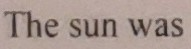 | | The sun was |
| 13           |  | 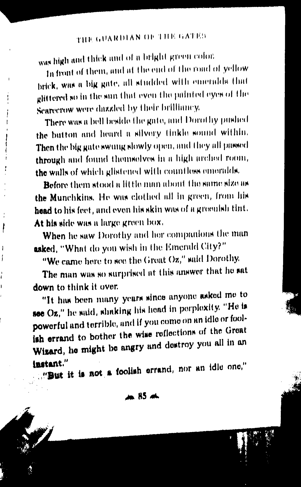| THT GUARDIAN Ob THEE GATES was high and Chick und oft delimit preen colon, infant of then, and a the end of the round of yellow brick, we a big gate. all studded with eneridely chat glittered a0 in the in that even the palate eyer ol the scarecrow were damaged by their brilliancy, There want bell bedded( he gate, mid Dorothy malice| the button and hoard a silvery gale sound within, Then the big gate twang slowly open, and they all passed through and fond themselves find high washed room, the walls of which glixtencod with countless omorilds, Before them stood the man abort tho same size tun the Munchkins, He was clothed ill din green, Trout hin head to his feet, and even his akin was of a greenish tint. At his side was a large green box, When he saw Dorothy and for companions Uie man asked,“ What do you wish in the[ emerald City?”“ We came here to so the Groat Oz," sad Dorothy. The man was so surprised at( his answer that ho sat down to think it over." Tt has been many years since anyone asked me to see Ox," he said, slinking his load in perplexity.“ He ts and if you come on an idle or fool- he wise reflections of the Groat y and destroy you all in an powerful and terrible, ish errand to bother t Wizard, he might be angry ant.”|“ a a foolish errand, nor an idle one, But it ts not an BS a |
| 14           | 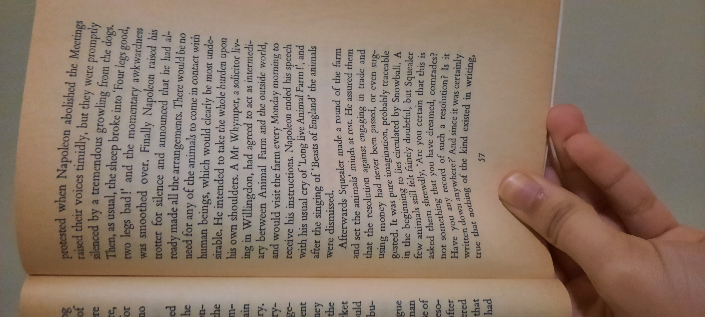 | | i tenement my were OUS grow]; P compel ce eng for the do f based!" and P broke into‘ Four logs“ i; a he over. final we whe B for silence and ally Napoleon raised his made all announced that h a” e arrange al- Me any of the cements. There would b put any of the animals to come i nn P beings, which would c 7 contact with Be. He intended to use the whe been few shoulders. A M Tole burden upon is willing. r whimper, a solicitor live| don, had agreed: between an, agreed to act as interned- Be would 2 am me Farm an the upside world, a farm every only morning to of peeve his instructions. Napoleon ended his speech Re h his usual cry of‘ Long live Animal Farm!’, and= egg the singing of‘ Beasts of inland’ the animals aka dismissed. Boo Afterwards Squealer made a round of the farm pe and set the animals’ minds at rest. He assured them- that the resolution against engaging in trade and y=; want money had never been passed, or even sun-" e Ie was pure imagination. probably traceable tested. J eo lies circulated by Snowball. A g ne. 11 feel faintly doubtful, but Squealer a; im the begin”. be caked her see dreamed that this is_ F not something’ chat a‘ Ps ve dreamed, comrades? a i face you* ne> such a resolution? Is j ad a: iqtven dow? anywhere And since it was: i& writ v0 og of the kind existed in went”, eruct m writing, BR GTEGRIR STS E |
| 15           | 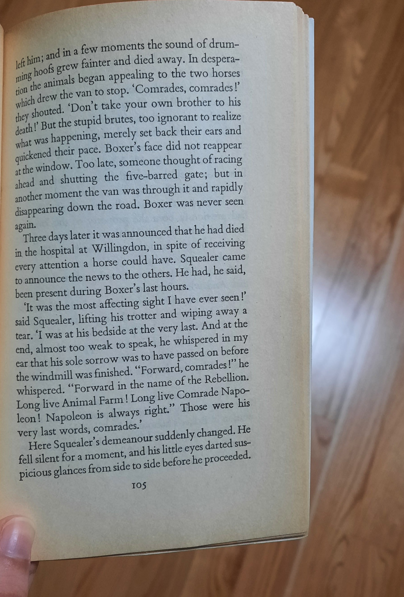 | 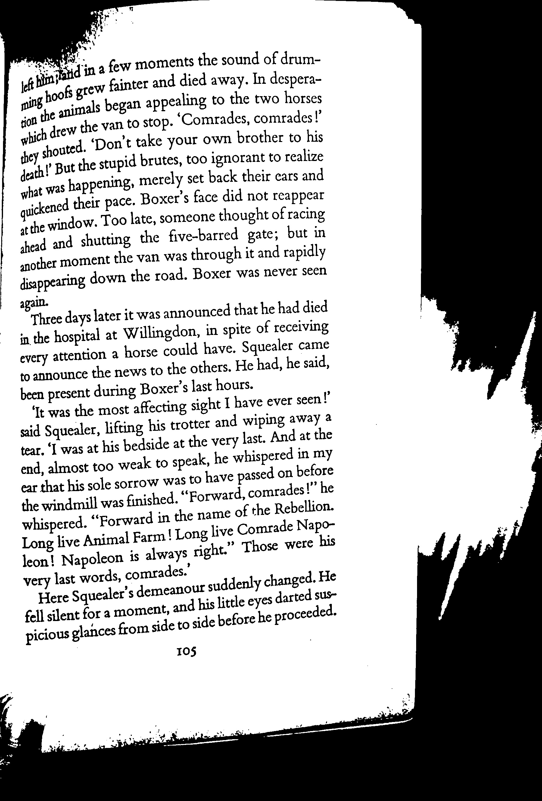| say{ in a few moments the sound of drum- f; grew finger and died away. In desperate- win 1 male began appealing to the two horses ic drew the van to stop.‘ Comrades, comrades!’ te y shouted.‘ Don’ t take your own brother to his feat! But the stupid brutes, too ignorant to realize that WaS happening, merely set back their cars and sickened their pace. Boxer’ s face did not reappear the window. Too late, someone thought of racing head and shutting the five- barred gate; but in other moment the van was through it and rapidly disappearing down the road. Boxer was never seen a he days later it was annoy unwed that he had died in the hospital at wellington, in spite of receiving every attention a horse could have. Squealer came to announce the news to the others. He had, he said, been present during Boxer’ s last hours.‘ It was the most affecting sight I have ever seen!’ said Squealer, lifting his trotter and wiping away 4 tear,‘ I was at his bedside at the very last. And at the end, almost too weak to speak, he whispered in my d on before ear that his sole sorrow was to have pass the windmill was finished.“ Forward, comrades!” he whispered.“ Forward in the name of the Rebellion. Long live Animal Farm! Long live Comrade nap- lean! Napoleon is always right.” Those were very last words, comrades. i suddenly changed. He Here Squealer’ s demeanor S* fell silent for a moment, and his little eyes darted us- side before be proceeded. vicious glances from side to 105 |
| 16           |  | | an cilia met the HOnZOn CaStap a warn orange glow across the sky. Birds flew in tanker heady home was the evening grew cooler The air smelled fresh, with a hint of er the nearby trees On the around. the glass rustled gently in the breeze, and people were feather the pack enjoying the last moments of daylight. It was the kind of evening tee red patine and appreciate the quiet moments in he the small town was quieten the eat, morning light. Streets were empty, except for a few birds Hopping frond sidewalk to sidewalk, pecking at crumbs. The old bakery on the corner was just expense and a tattoo freshly baked bread filled the air People slowly began to stir in their homes and the day started to take shape[ twas one of those peaceful mornings when nothing seemed urgent, and everything felt calm and content The ocean stretched out endlessly before her, its surface shimmering in the sunlight. Waves lapped gently at the shore, their rhythm soothing and steady. The sand was warm beneath her feet, and the sound of seagulls echoed in the distance. She brea |
